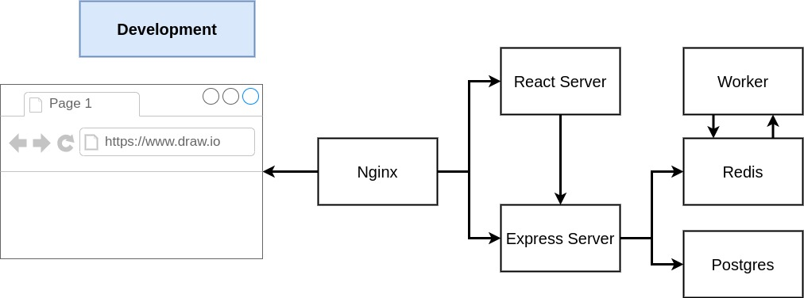

# 3 Tier CRUD App for learning docker/containers

based on course content "Build, test, and deploy Docker applications with Kubernetes while learning production-style development workflows"

https://kyndryl.udemy.com/course/docker-and-kubernetes-the-complete-guide/learn/lecture/11437202#overview

Section 8: Building a Multi-Container Application

